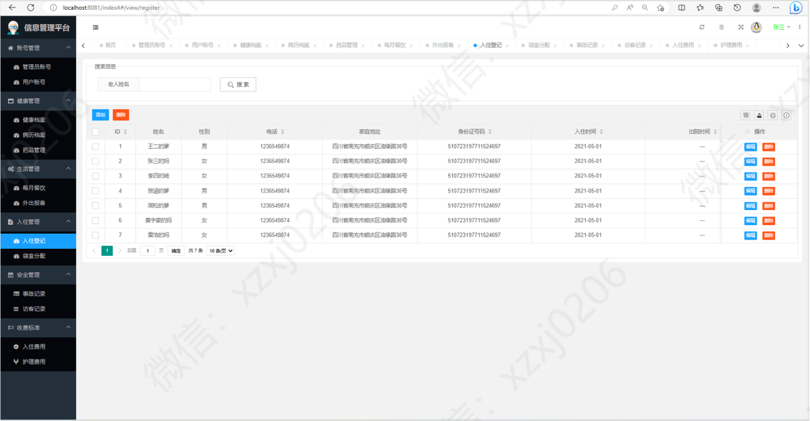

# 养老院管理系统

### 有问题，或者需要协助调试运行项目的, 可以添加 QQ：2529519551 ，或者wx ：xzxj0206

## 一、介绍

springboot+mybatis的养老院管理系统

本系统的主要功能有：

账号管理：管理员账号，用户账号

健康管理：健康档案，病例档案，药品管理

生活管理：每月餐饮，外出报备

入住管理：入住登记，寝室分配

安全管理：事故记录，访客记录

收费标准：入住费用，护理费用

## 二、系统运行界面

## 三、超级管理员模块部分功能页面展示

## 四、管理员模块部分功能页面展示

## 五、用户模块部分功能页面展示

